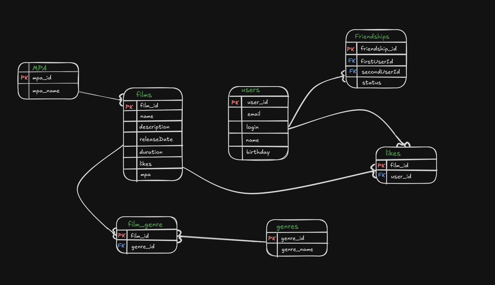

## 📊 Схема базы данных

Ниже представлена схема базы данных приложения:



### 📝 Примеры SQL-запросов

**Получение всех фильмов:**
```sql
SELECT * 
FROM films;
```
**Получить пользователя по ID:**
```sql
SELECT * FROM users WHERE id = 1;
```
**Получить всех друзей пользователя (ID = 1):**
```sql
SELECT u.*
FROM friendships AS f
JOIN users AS u ON u.id = f.second_user_id
WHERE f.first_user_id = 1;
```
**Получить жанры фильма:**
```sql
SELECT g.*
FROM film_genres AS fg
JOIN genres AS g ON g.id = fg.genre_id
WHERE fg.film_id = 10;
```
**Топ 10 фильмов по количеству лайков::**
```sql
SELECT f.*, COUNT(l.user_id) AS likes_count
FROM films AS f
LEFT JOIN likes AS l ON f.id = l.film_id
GROUP BY f.id
ORDER BY likes_count DESC
LIMIT 10;
```


